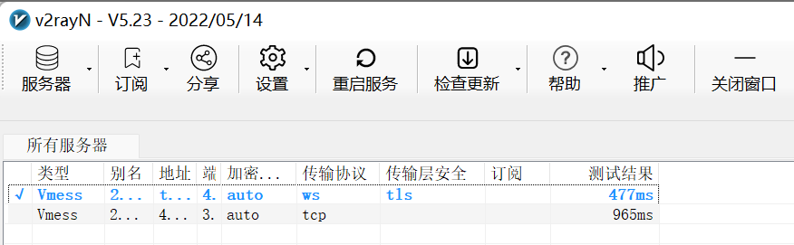
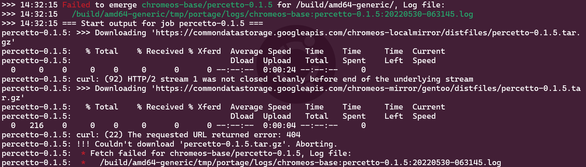
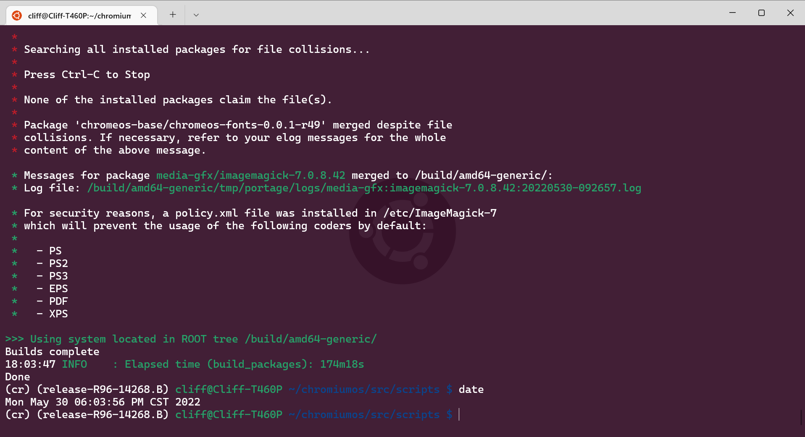
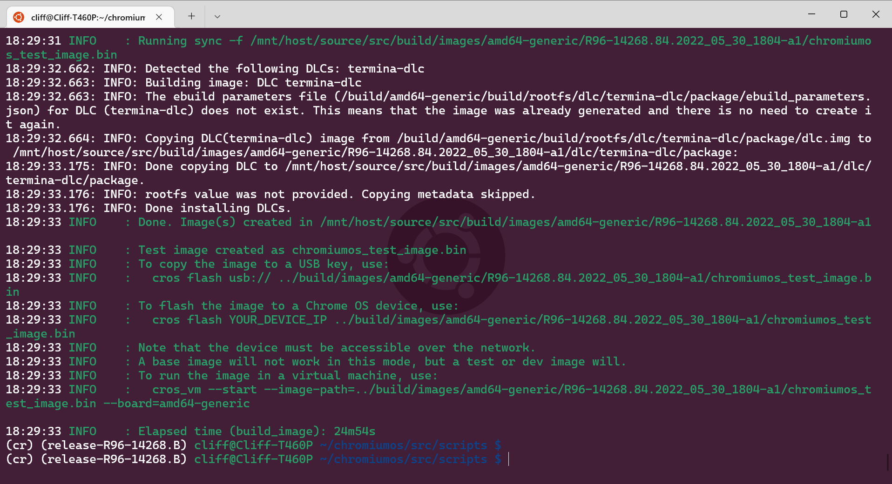
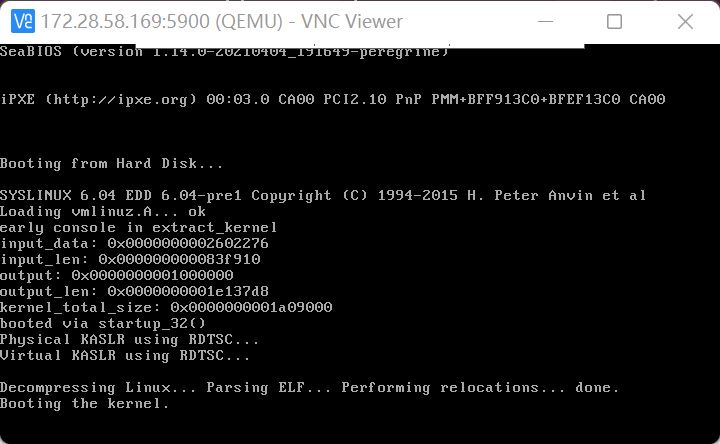
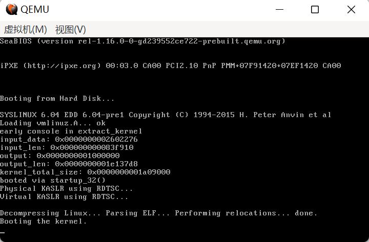
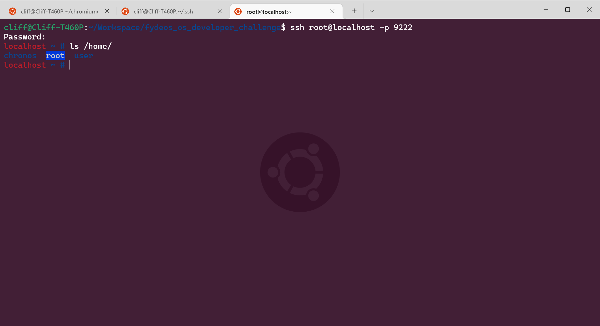
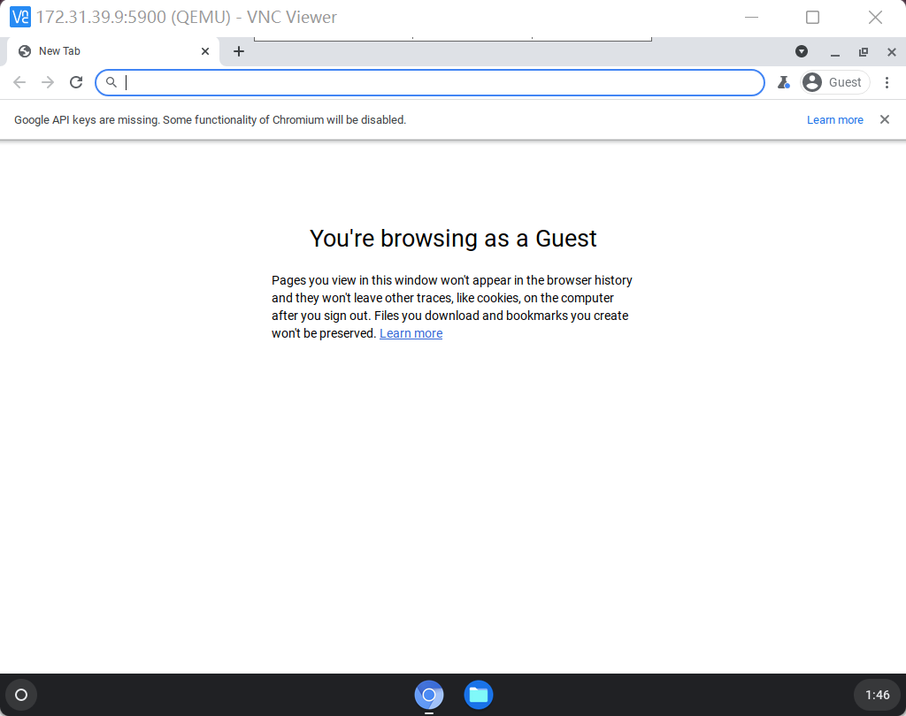
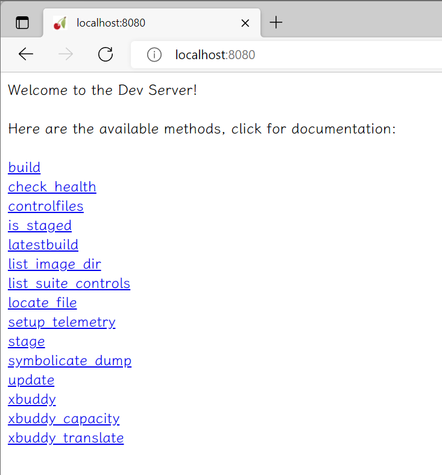

# fydeos_os_developer_challenge


Here're steps I've taken to finish FydeOS OS developer challenge, and results.


## 0. Connectivity, tools & infrastructure readiness

**Network part**

I've already have 2 VPS running on Vultr, setup by me but owned by my friends. And I use v2ray as the proxy client.

The bandwidth ISP provided  is only 100Mbps, looks like I cannot get good ping and speed. I didn't tweak those vps before because I just need google to search, no need for performance.



As I tested, the speed of download from google source site is not stable, keeps changing from 50KB to 200KB. But I really don't want to upgrade my ISP service and network devices for just a test. So I kept using my previous servers without registering a new one on Digital Ocean as recommended.

I usually like to setup socks/http/https proxy explicitly with config files in my home environment because it's clear when things goes wrong. My previous company provided AnyConnect vpn, so I didn't need to setup the transparent router. If it's necessary, it could be done with an OpenWRT router for this purpose.


**Local development environment**

I'm using an old Thinkpad T460p with 32G memory and 512G SSD, running windows 11. I use WSL2 as the linux part, with 20G memory and 256G vm disk by default, running Ubuntu 20.04.


## 1.  Get Chromium OS code and start building

**Config proxy in WSL2**

For the wsl2 proxy part, need to [disable windows firewall on interface `vEthernet(WSL)` first](https://github.com/microsoft/WSL/issues/4139#issuecomment-850071837).

And setup `~/.gitconfig `  and `~/.curlrc` to use proxy running on windows.

Then setup environment variables: `http_proxy/https_proxy/all_proxy`

Generate a `~/.boto` file with proxy set, looks like it's for `gclient`, not very sure if it's mandatory.


**Prepare before chroot**

Just as google document said. I run the following command lines in terminal:

``` shell
# setup needed apps for the build process
sudo apt-get install git gitk git-gui curl xz-utils python3-pkg-resources python3-virtualenv python3-oauth2client

# prepare depot_tools and setup the path (NEED REPLACEMENT) in ~/.bashrc
git clone https://chromium.googlesource.com/chromium/tools/depot_tools.git
export PATH=/path/to/depot_tools:$PATH

# setup locales to en_US.UTF-8
sudo apt-get install locales
sudo dpkg-reconfigure locales

# configure git, NEED TO REPLACE email and name to my own
git config --global user.email "you@example.com"
git config --global user.name "Your Name"

# init work directory
mkdir -p ~/chromiumos
cd ~/chromiumos
repo init -u https://chromium.googlesource.com/chromiumos/manifest -b release-R96-14268.B
repo sync -j4

# create chroot environment and enter
cros_sdk
```

Actually I did `repo sync` for main branch 2 days before. So I just switched branch by: `repo forall -c 'git checkout -b release-R96-14268.B' `.


**Build image inside chroot**

> Note: When building main branch previously, I got a `Permission Error: [Errno 13]`. Found [this post](https://thelinuxcluster.com/2021/03/05/python-errno-13-permission-denied/) as reference and solved.
>

``` shell
# Note: this part works only inside chroot, under ~/chromiumos/src/scripts

# setup board
export BOARD=amd64-generic
setup_board --board=${BOARD}
./set_shared_user_password.sh

# for the SEMAPHORE permission error problem
sudo chmod 777 /dev/shm
sudo chmod +t /dev/shm

# build packages fastest as commented in script, not sure if I missed something
./build_packages --board=${BOARD} --nowithautotest --noworkon

# build test image
./build_image --board=${BOARD} --noenable_rootfs_verification test

# convert image to qemu raw image
./image_to_vm.sh --from=/mnt/host/source/src/build/images/${BOARD}/latest/ --board=${BOARD} --test_image
```


Cannot get Google API keys, looks like my account was disabled from using google cloud console. I sent email to google, they replied, telling me it usually takes 2 business days or longer.


Met an error during the build_package process, looks like network error:




The build process stopped outputting later, no response when pressing enter key, not sure if it's caused by the previous network error. I broke the process and re-executed original `./build_packages` script. It really took some time.

Here's the build_packages result.



And the build_image result.



Generated vm image at: `/mnt/host/source/src/build/images/amd64-generic/R96-14268.84.2022_05_30_1804-a1/chromiumos_qemu_image.bin`.

To be honest, it's really NOT difficult in this part. But it took longer than I thought. I think it will be better with more powerful PC with ubuntu installed directly (not via WSL2), and network speed affects the build time obviously as well. But the best method is to dig what the script does, and do some preparation or some modification on the script before build.


**Confirmed vm image problem and redo a clean build**

As learned from [Google's document](https://chromium.googlesource.com/chromiumos/docs/+/2efe4b73ea2109870480a3d6148024686faf1e6e/cros_vm.md). VM could be started with this command.

``` shell
# (inside)
export BOARD=amd64-generic
cros_vm --image-path /mnt/host/source/src/build/images/amd64-generic/R96-14268.84.2022_05_30_1804-a1/chromiumos_qemu_image.bin --start --board ${BOARD} --qemu-args " -vnc :0"
```

It will start a vm which could be connected via VNC Viewer in Windows. But it keeps restarting at `Booting the kernel.` line.




I haven't any experience using qemu. So I tried to install qemu for windows to double check the image, the corresponding image path in windows is:  `\\wsl.localhost\Ubuntu\home\cliff\Workspace\chromiumos\src\build\images\amd64-generic\R96-14268.84.2022_05_30_1804-a1\chromiumos_qemu_image.bin`.

Then I started qemu for windows with this command:

``` shell
# windows power shell, under C:\Program Files\qemu
.\qemu-system-x86_64.exe -drive file="\\wsl.localhost\Ubuntu\home\cliff\Workspace\chromiumos\src\build\images\amd64-generic\R96-14268.84.2022_05_30_1804-a1\chromiumos_qemu_image.bin,format=raw,index=0,media=disk"
```

Qemu for windows hangs at `Booting the kernel.` line, just like the previous case.




Guess I got a wrong qemu raw image, I used `--cleanbuild` before sleep to completely restart the build packages process, but no luck for me, saw some errors on different packages in the morning.

When error happens, I think this command could be used to emerge one single package, e.g.

``` shell
emerge-amd64-generic chromeos-base/chrome-icu
```

But this time, I cannot get `image_to_vm.sh` normally generate the qemu raw image this time. Got this error:

``` shell
mount: /mnt/host/source/src/build/images/amd64-generic/R96-14268.84.2022_05_31_0915-a1/stateful_dir: wrong fs type, bad option, bad superblock on /dev/loop0p1, missing codepage or helper program, or other error.
11:22:18 ERROR   : mount failed: image=/mnt/host/source/src/build/images/amd64-generic/R96-14268.84.2022_05_31_0915-a1/vm_temp_image.bin device=/dev/loop0p1 target=/mnt/host/source/src/build/images/amd64-generic/R96-14268.84.2022_05_31_0915-a1/stateful_dir format=ext4 ro/rw=rw
Current loopback device status:
    /dev/loop0: [2080]:2646859 (/mnt/host/source/src/build/images/amd64-generic/R96-14268.84.2022_05_31_0915-a1/vm_temp_image.bin)
```

And I found something in dmesg:

``` 
[  296.516361] EXT4-fs (loop1p3): mounting ext2 file system using the ext4 subsystem
[  296.520852] EXT4-fs (loop1p3): mounted filesystem without journal. Opts: (null)
[  297.679618] EXT4-fs (loop0p3): mounting ext2 file system using the ext4 subsystem
[  297.684981] EXT4-fs (loop0p3): mounted filesystem without journal. Opts: (null)
[  297.690271] EXT4-fs (loop0p1): The kernel was not built with CONFIG_QUOTA and CONFIG_QFMT_V2
[  913.494619] EXT4-fs (loop1p3): mounting ext2 file system using the ext4 subsystem
[  913.503539] EXT4-fs (loop1p3): mounted filesystem without journal. Opts: (null)
[  914.750599] EXT4-fs (loop0p3): mounting ext2 file system using the ext4 subsystem
[  914.759467] EXT4-fs (loop0p3): mounted filesystem without journal. Opts: (null)
[  914.764939] EXT4-fs (loop0p1): The kernel was not built with CONFIG_QUOTA and CONFIG_QFMT_V2
```

I guess my file system is broken now. No further info from [this WSL issue](https://github.com/microsoft/WSL/issues/8083). Re-executed `build_image` OK, but `image_to_vm.sh` still failed. I may need to check my WSL environment later.


**Run image in qemu**

Got cros_vm run with command, and connected with vnc, not sure if it's my latest locally built vm image:

``` shell
cros_vm --start --board ${BOARD} --qemu-args " -vnc :0"
```


It's weird that cros_vm failed to start ssh client. As the [document](https://chromium.googlesource.com/chromiumos/docs/+/master/cros_vm.md#SSH-into-the-VM) said, I used this command in shell for ssh to connect:

``` shell
# (shell), password is test0000
ssh root@localhost -p 9222
```




At last, it looks like my last generated test_image could directly run in cros_vm:

``` shell
cros_vm --start --image-path=../build/images/amd64-generic/R96-14268.84.2022_05_31_1610-a1/chromiumos_test_image.bin --board=amd64-generic --qemu-args " -vnc :0"
```

Internet connection not stable, I could only browse as guest.




**Some Notes**

Every time I start `build_packages` process, it took hours on my machine, much longer than the 90 minutes stated in document. Sometimes it just keeps outputting something not that informative like this:

``` shell
>>> 22:03:41 Still building (chromeos-base/chrome-icu-96.0.4664.209_rc-r1:0/96.0.4664.209_rc-r1::chromiumos, ebuild scheduled for merge to '/build/amd64-generic/') after 1:04:59.943283
```

I took quite some time to learn that the build system was executing some gclient operations which takes a lot time, but I don't know how to skip this process yet.


## 2. Kernel replacement

Did a quick search and found [this article](https://colinxu.wordpress.com/2020/08/06/build-chromium-os%E2%80%8E-for-qemu/). As it commented, looks like build file for kernel 5.10 is already in ` ~/trunk/src/third_party/chromiumos-overlay/sys-kernel/chromeos-kernel-5_10/`, so I think just need to do as following sequence:

1. modify the kernel version in `~/trunk/src/overlays/overlay-amd64-generic/profiles/base/make.defaults`, change kernel-4_14 to kernel-5_10
2. unmerge old kernel
2. build new kernel
4. rebuild image

Command to be used in step 2/3/4:

``` shell
# (inside)
export BOARD=amd64-generic
# unmerge kernel 4.14 first
emerge-amd64-generic --unmerge sys-kernel/chromeos-kernel-4_14
# build kernel 5.10
emerge-amd64-generic sys-kernel/chromeos-kernel-5_10
# TODO: build packages and image again with new kernel, no time to test yet
```

The last build process were not tested. Till now, I found these errors:

1. build_image directly will fail
2. build_packages report build error for package ` chromeos-base/cryptohome`, looks like some configuration related to `direncription_allow_v2` need to be enabled, edit the ebuild file and it works


## 3. CrOS devserver in docker
Run `start_devserver` directly will get an permission error, need to specify a writable `static_dir`. For example:

``` shell
# (inside)
start_devserver --static_dir .
```

This command creates a `static` dir in current directory, and put some files under it.

I got another warning, guess that's just because of "python code not up-to-date". No need to handle it.

```
[30/May/2022:22:02:36] ENGINE Listening for SIGTERM.
INFO:cherrypy.error:[30/May/2022:22:02:36] ENGINE Listening for SIGTERM.
[30/May/2022:22:02:36] ENGINE Listening for SIGHUP.
INFO:cherrypy.error:[30/May/2022:22:02:36] ENGINE Listening for SIGHUP.
[30/May/2022:22:02:36] ENGINE Listening for SIGUSR1.
INFO:cherrypy.error:[30/May/2022:22:02:36] ENGINE Listening for SIGUSR1.
[30/May/2022:22:02:36] ENGINE Bus STARTING
INFO:cherrypy.error:[30/May/2022:22:02:36] ENGINE Bus STARTING
Exception in thread Thread-1:
Traceback (most recent call last):
  File "/usr/lib64/python3.6/threading.py", line 916, in _bootstrap_inner
    self.run()
  File "/usr/lib64/python3.6/threading.py", line 864, in run
    self._target(*self._args, **self._kwargs)
  File "/usr/lib64/devserver/health_checker.py", line 60, in func_require_psutil
    return func(*args, **kwargs)
  File "/usr/lib64/devserver/health_checker.py", line 141, in _refresh_io_stats
    prev_disk_io_counters = psutil.disk_io_counters()
  File "/usr/lib64/python3.6/site-packages/psutil/__init__.py", line 2032, in disk_io_counters
    rawdict = _psplatform.disk_io_counters(**kwargs)
  File "/usr/lib64/python3.6/site-packages/psutil/_pslinux.py", line 1117, in disk_io_counters
    for entry in gen:
  File "/usr/lib64/python3.6/site-packages/psutil/_pslinux.py", line 1090, in read_procfs
    raise ValueError("not sure how to interpret line %r" % line)
ValueError: not sure how to interpret line '   1       0 ram0 0 0 0 0 0 0 0 0 0 0 0 0 0 0 0 0 0\n'

[30/May/2022:22:02:37] ENGINE Serving on http://:::8080
INFO:cherrypy.error:[30/May/2022:22:02:37] ENGINE Serving on http://:::8080
[30/May/2022:22:02:37] ENGINE Bus STARTED
INFO:cherrypy.error:[30/May/2022:22:02:37] ENGINE Bus STARTED
```



Although the devserver is running, I'm not very sure about what it serves, and if it works properly.

I guess I may need to update files in `static_dir`, update parameters chromium os image, and run the chromium os instance to make it communicate with devserver. Just like task 4 did.

BTW, the document looks not up-to-date with the actual script, for example, the `-t` parameter is already marked as deprecated when I checked the output of `start_devserver --help`, but it's still listed in the [document](https://chromium.googlesource.com/chromiumos/chromite/+/refs/heads/master/docs/devserver.md).

I didn't see docker part in the document. But the devserver looks like a standalone function, and should be easily implemented into a Dockerfile.

I also saw `~/chromiumos/src/platform/factory/setup/cros_docker.sh`, which pulls a docker image from [here](https://storage.googleapis.com/chromeos-localmirror/distfiles/docker-1.10.3.tgz). That's a factory server docker, so that may work as well.


## 4. Connecting the dots

Didn't actually do that, but I think the workflow means:

1. Change config in the chromium os image then it could connect to local devserver when it's running
2. Use `./cros_generate_update_payload` in cros_sdk to create the OTA package, reference [here](https://chromium.googlesource.com/aosp/platform/system/update_engine/+/HEAD/README.md#Update-Payload-Generation)
3. Make the OTA package to be served with the devserver
4. Run cmd in chromium os (via ssh) then it could connect the devserver and get the update


## 5. Documentation and other

Here's summary of what I did in this challenge:

* successfully downloaded depot_tools and chromium os source code
* finished setup of chroot environment
* first time build, generated image and vm raw image, but failed to run in vm
* second time clean build, generated image, but failed to generate vm raw image because of loop device error
* started cros_vm and default vm image, connected with vnc and ssh
* third time build image only, no vm raw image, cros_vm start ok, vnc and ssh ok
* unmerged kernel 4.14, and emerged kernel 5.10, failed to generate updated image
* started devserver in chroot only
* gave unconfirmed speculation on the connection between devserver and chromium os instance


What I learned:

* I need to upgrade my network later
* WSL2 environment seems not very suitable for chromium os development


I have to admit that I haven't used or compiled chromium os several days before, my understanding to that is still very poor.
